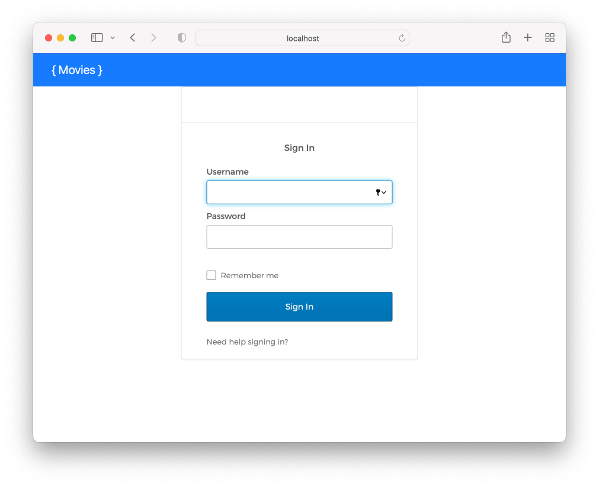
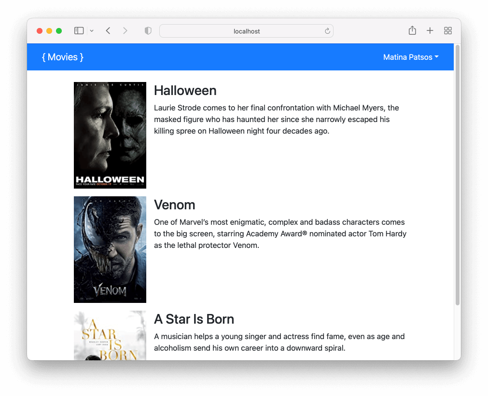

# Okta Challenge

In Visual Studio code, press `command+shift+v` (Mac) or `ctrl+shift+v` (Windows) to open a Markdown preview.

## Reasons for the Challenge

It is hard to quickly and securely add authentication to your application. Okta is an industry wide used identity platform. Software companies and engineer's often turn to third-party services like Okta instead of writing their own signin process.

### Examples and Documentation

See [the companion Okta code example](../../examples/okta). It's a completed version of this exercise.

This exercise is based on the [Sign in to your SPA with the embedded Okta Sign-In Widget](https://developer.okta.com/docs/guides/sign-in-to-spa-embedded-widget/react/main/) tutorial from Okta.

## Getting Started

You will need to run the authorization and API server. Please follow the _Getting Started_ steps [in this README.md](../../authorization-server/README.md) on how to install and start the authorization and API server.

Using your command line, you will need to navigate to the this folder, install all dependencies.

```bash
cd exercises/15-okta/
code . # if you would like to open this in a separate VSCode window
npm install
```

When you start this application for the first time, you should see errors or a blank screen.

## User Stories

As a user, I would like to login so that I can see a list of my favorite movies.

As a user, I should see my name in the top right of the navigation once I signin.





## Acceptance Criteria

- You must render and Okta signin widget to the screen. The Okta signin form must be functional and signin the user.
- Once the user is signed in, they should see a list of movies. You will need to pass the access token to the Movies API in order for this to work.
- When the user signs in, their name should appear on the top right, inside of the `<NavBar />` component. You will need to get this information from Okta.
- If the user is not signed, they should be redirected back to the Okta signin form. You will complete this with Okta's `<SecureRoute />` component.

## Instructions

### Part 1: Create an Okta application integration

You must [signup for Okta Developer](https://developer.okta.com/signup/) or [login to the Okta Admin Console](https://developer.okta.com/login/). Please create a new username and password instead of signing up with Github or Google. If you signup with Github or Google, you will need to reset your password later on, and there may be permission errors when you try to do this.

We will try to use the _interaction grant type_. To enable this:

1. Click on _Security > API_.
2. Click on where it says _default_. (This should be underneath the _Add Authorization Server_ button.)
3. Click on the _Access Policies_ tab.
4. Scroll down and find where it says _Default Policy Rule_ underneath the rule name. Click on the pencil icon to edit this.
5. If there, check the _Interaction Code_ checkbox for the grant type and click on _Update Rule_.

If you did not see the _Interaction Code_ checkbox, open up the _src/oktaConfig.js_ file and change _useInteractionCodeFlow_ to false.

```javascript
export const OKTA_WIDGET_CONFIG = {
  // ...
  useInteractionCodeFlow: false,
};
```

You will need to create an Okta application for your Single-Page-App (React). Here is how you do that:

1. On the sidebar on the left, go to _Applications > Applications_.
2. Click on the _Create App Integration_ button.
3. Select the _OIDC - OpenID Connect_ as the sign-in method option. Then select _Single-Page Application_ as the application type and click _Next_.
4. Name your application "React Class SPA App".
5. Check the _Authorization Code_, _Interaction Code_ (if there), and _Refresh Token_ boxes for the grant types.
6. Change the sign-in redirect URIs to _http://localhost:3000/login/callback_
7. Change the sign-out redirect URIs to _http://localhost:3000_
8. Underneath _Trusted Origins_, add _http://localhost:3000_ to the base URIs
9. Underneath _Assignments_, select _Allow everying in your organization to access_ from the controlled access section.
10. Click on the _Save_ button.
11. Select the _Sign On_ tab and scroll down. If you see a _User authentication_ panel, click on the _Edit_ link and change the authentication policy to _Password_ only and click on the _Save_ button.

Once saved, do not exit this page, because we will need this open for the next part.

### Part 2: Configure Okta in your React application

You should see a file called _.env.example_ in the same location as this _README.md_. Open this file as save it as _.env_ in the same directory. You will use this file to configure your Okta settings in your React application. You will need to change the **REACT_APP_OKTA_ISSUER** and the **REACT_APP_OKTA_CLIENT_ID** next. Both of these values are used inside of _src/oktaConfig.js_.

To configure the Okta issuer URL, go back to the Okta Admin Console. Click on the _General_ tab underneath your Okta application's name. Scroll down to where is says _Okta domain_ and copy the domain. In the _.env_ file, replace where it says "yourdomain" with the domain in your clipboard. So if your Okta domain is _dev-123456789.otka.com_, the **REACT_APP_OKTA_ISSUER** should be set like this:

```
REACT_APP_OKTA_ISSUER="https://dev-123456789.otka.com/oauth2/default"
```

You will find the value for the client ID in the Okta Admin Console below where it says _Client Credentials_. Copy the id to your clipboard and set the **REACT_APP_OKTA_CLIENT_ID** to the value in your clipboard like this:

```
REACT_APP_OKTA_CLIENT_ID="12345678901234567890"
```

### Part 3: Adding the Okta Signin Widget to your React application

Before you begin coding, you will need to install libraries from Okta and start the application.

```bash
npm install @okta/okta-signin-widget @okta/okta-auth-js @okta/okta-react
npm start
```

Before you continue, you may want to take a look at _src/oktaConfig.js_, _src/components/Login/OktaSignInWidget.jsx_, and _src/components/Login/Login.jsx_.

Inside of _src/components/Login/Login.jsx_, import the _OktaSignInWidget_ component. Replace where it says "TODO put the <code>&lt;OktaSignInWidget /&gt;</code> here." with the `<OktaSignInWidget />` component. When you do this, you will see the error "Oops! There was a problem signing you in."

Open _src/components/App/App.jsx_. You will be initializing the Okta configuration and setting up routing here. See _examples/okta/src/components/App/App.jsx_ for an example on how to do this.

### Part 4: Securing your APIs with access tokens

You must be logged in to see the list of movies on the homepage. The API that returns a list of movies requires a valid access token from Okta.

You will need to run the authorization and API server. Please follow the _Getting Started_ steps [in this README.md](../../authorization-server/README.md) on how to install and start the authorization and API server.

In _src/components/Movies/Movies.jsx_, you will need to get the Okta token from Okta so that it to the movies API inside of an _Authorization_ header. See _examples/okta/src/components/Movies/Movies.jsx_ for an example of how to do this.

### Part 5: Seeing whether or not a user has authenticated

If you need to conditionally render content based on whether or not the user is logged in, you can use get this information from Okta's `useOktaAuth` hook.

Complete _src/components/Login/Login.jsx_ so that it will redirect to user page to the home page if they have already signed in.

### Part 6: Looking up user information from Okta

If you need to display the user's name, email address, or some other related information, you can do this with Okta. Inside of _/src/components/NavBar/NavBar.jsx_, you are going to call on the Okta API to lookup and then display the user's full name on the top right of the screen.

## Troubleshooting

If you see any CORS errors from Otka, this mean you will need to add `http://localhost:3000` as a trusted domain. See https://developer.okta.com/docs/guides/enable-cors/main/#browser-support on how to do this.

If you are having trouble logging in, view the logs inside of the Admin Console. Go to _Reports > System Log_.

You can view your OAuth meta data here. Replace "yourdomain" with your Okta domain.

- Interaction flow: https://yourdomain/oauth2/default/.well-known/openid-configuration
- Authorization flow: https://yourdomain/oauth2/default/.well-known/oauth-authorization-server
