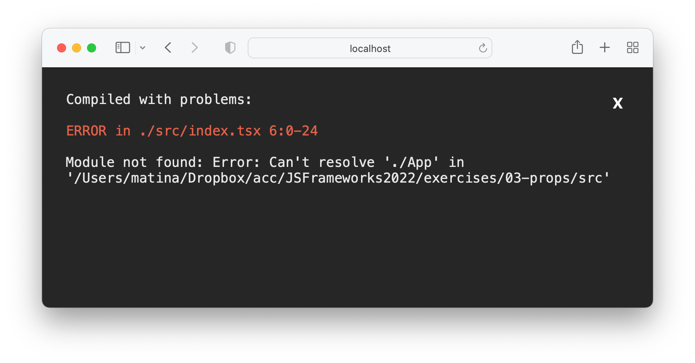

# TypeScript

In Visual Studio code, press `command+shift+v` (Mac) or `ctrl+shift+v` (Windows) to open a Markdown preview.

## Reasons for Challenge

TypeScript is a very marketable skill for those of you who are job searching. It is a very useful tool that stops you from introducing type related bugs from application.

## Examples and Documentation

- [React TypeScript Cheatsheet](https://react-typescript-cheatsheet.netlify.app/docs/basic/setup)
- TypeScript and React: [Components](https://fettblog.eu/typescript-react/components/) | [Hooks](https://fettblog.eu/typescript-react/hooks/) | [Events](https://fettblog.eu/typescript-react/events/)
- [TutorialsTeacher](https://www.tutorialsteacher.com/typescript)

## Getting Started & Instructions

You will be refactoring two of your previous assignments to use TypeScript.

- exercises/03-props/
- exercises/06-forms/

To convert these assignments to TypeScript assignment, you will need to navigate to the root of each and then install all React TypeScript dependencies. For example, for the _03-props_, you would do:

```
cd exercises/03-props/
code . # if you would like to open this in a separate VSCode window
npm install --save typescript @types/node @types/react @types/react-dom @types/jest
```

Rename the _index.js_ file as _index.tsx_ and then start the application with `npm start`. This should generate a TypeScript configuration file inside of the root of the exercise (e.g. _exercises/03-props/tsconfig.json_). If you are getting errors like this below ...



... check to see if the _tsconfig.json_ file is there. If it is not, you will need to create the file yourself. Copy and paste the following content, save, and restart the server.

```json
{
  "compilerOptions": {
    "target": "es5",
    "lib": ["dom", "dom.iterable", "esnext"],
    "allowJs": true,
    "skipLibCheck": true,
    "esModuleInterop": true,
    "allowSyntheticDefaultImports": true,
    "strict": true,
    "forceConsistentCasingInFileNames": true,
    "noFallthroughCasesInSwitch": true,
    "module": "esnext",
    "moduleResolution": "node",
    "resolveJsonModule": true,
    "isolatedModules": true,
    "noEmit": true,
    "jsx": "react-jsx"
  },
  "include": ["src"]
}
```

Rename all files that contain React components so that they end with _.tsx_. You will see errors on your screen. Your job is to refactor the code so that it is in TypeScript.

## Acceptance Criteria

- Your application starts without any errors.
- All files with React components to end with the _.tsx_ extension
- All of your code has typed annotations.
- You do not use the `any` type.
