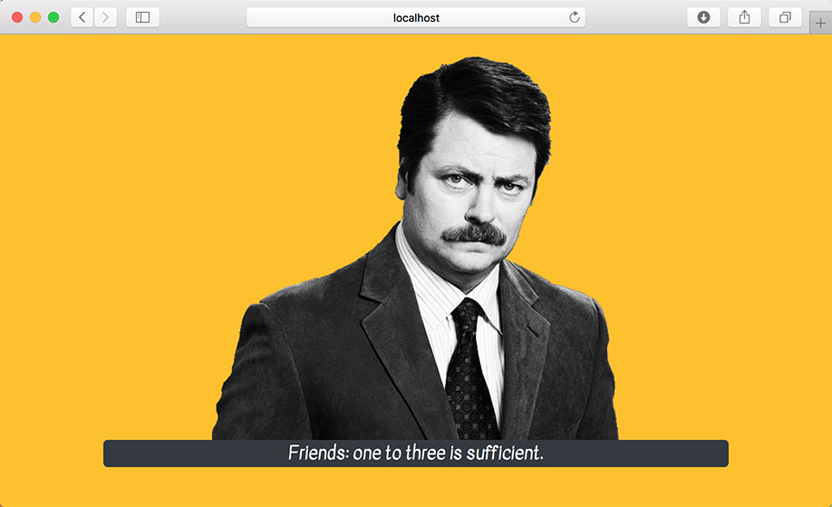

# Zustand Challenge 17b

In Visual Studio code, press `command+shift+v` (Mac) or `ctrl+shift+v` (Windows) to open a Markdown preview.

## Reason for the Challenge

To help you get a basic understanding on how to use AJAX requests with zustand.

## User Stories

As a user, I want to see a Ron Swanson quote immediately on my screen.

As a user, I want to see feedback if the quote is loading or if there is an error.

## Acceptant Criteria

- The application should make AJAX request to the _Ron Swanson Quote_ inside the zustand store.
- It should display a Ron Swanson quote on the screen using the zustand store.
- It should display some kind of loading message or feedback when an AJAX request is loading.
- It should display an error message if there as error making the AJAX request.

## Instructions

Before doing this exercise, read the documentation for the [Ron Swanson Quotes API](https://github.com/jamesseanwright/ron-swanson-quotes).

If you would like to use the Axios library, install it with `npm install axios`. (`create-react-app`. You will also need to install zustand `npm install zustand --save` to complete this exercise.)

Complete the instructions in [App.jsx](src/App.jsx).
