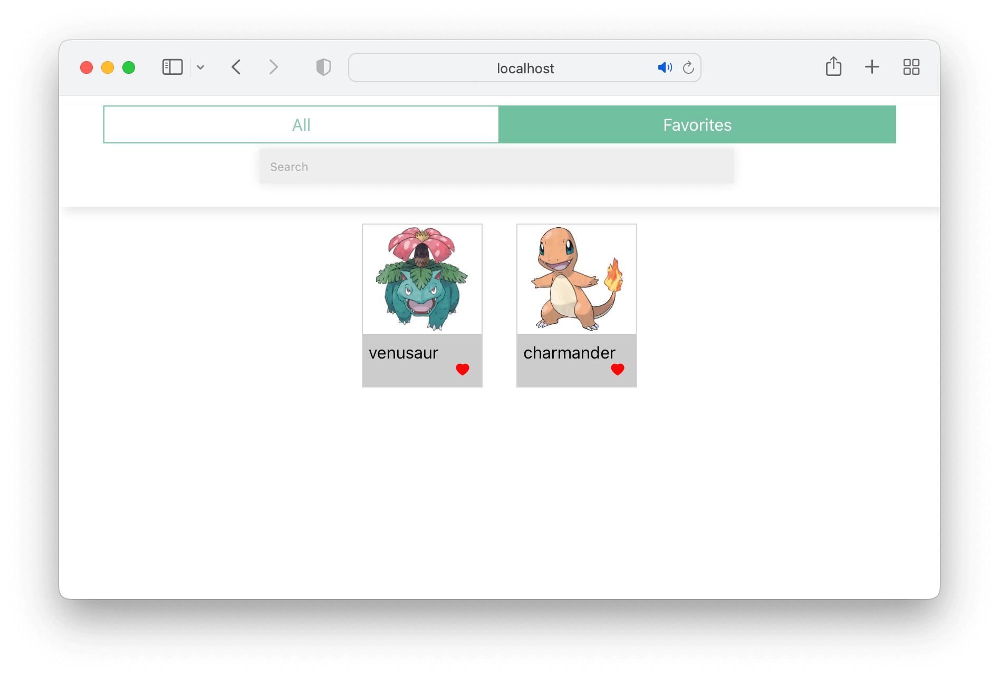

# Zustand Pokemon Challenge

In Visual Studio code, press `command+shift+v` (Mac) or `ctrl+shift+v` (Windows) to open a Markdown preview.

## Reasons for the Challenge

Much of working with React is learning how to manage global state. Libraries such as Zustand provide the tools and feature to share state between multiple components that go beyond the Context API.

## Examples and Documentation

Zustand resources:

See [https://docs.pmnd.rs/zustand/recipes/](https://docs.pmnd.rs/zustand/recipes/)

## Getting Started

Using your command line, you will need to navigate to the this folder, install all dependencies, and start the app.

```bash
cd exercises/17-zustand/
code . # if you would like to open this in a separate VSCode window
npm install
npm start
```

To stop the application, press `ctrl+c`.

To run the tests:

```shell
npm run test
```

If you do not see any test results, press `a` to run all tests. The tests will rerun whenever you make a change.

To stop the tests, press `ctrl+c`.

## User Stories

As a user, I would like to be able to search for Pokemon.

As a user, I would like to select a favorite pokemon from a list of pokemon.

As a user, I should be able to see all my favorite pokemon and only my favorite Pokemon in a list.




## Acceptance Criteria

You will be refactoring this to use Zustand. This application should keep all of the existing functionality and the state should be managed by Zustand:

- You should create a global store with Zustand's `create` function.
- Your Zustand store should contain the list of Pokemon.
- The "All" tab should display all Pokemon from the store.
- The search feature should filter the list of Pokemon from the store.
- The "Favorites" tab, it should only display the favorited Pokemon from the store.
- Clicking on the heart outline icon should store the Pokemon as a favorite Pokemon in the store.
- Clicking on a solid red heart icon will remove a Pokemon as a favorite from the store.

The application should also be converted to Typescript.

## Instructions

The application is fully function right now. the list of Pokemon is stored as state within the `<App />` composed and is passed down to children components `<Card />` and `<Search />` Your job is to refactors this so that is uses Zustand to manage its state.

Before you begin, you will need to install Zustand. Run `npm install zustand`.

Create a file called _src/createStore.js_. You will need to setup the here first. The list of Pokemon needs to be stored in the global store.

Update _src/App.jsx_ so that it gets all Pokemon from the store. The functions in this file like `handleOnSearch` and `handleOnPokemonClick` should update the state of Pokemon in the global store instead of local state with `<App />`.

Once you have completed setting up and using your store, try to see if you can refactor this to TypeScript.
