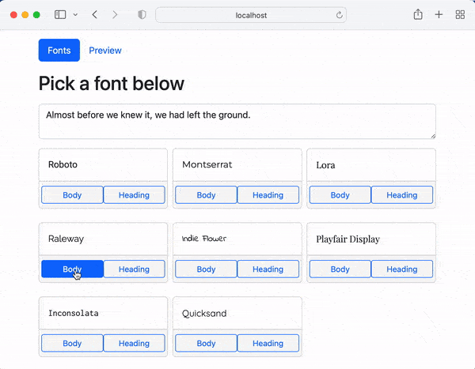
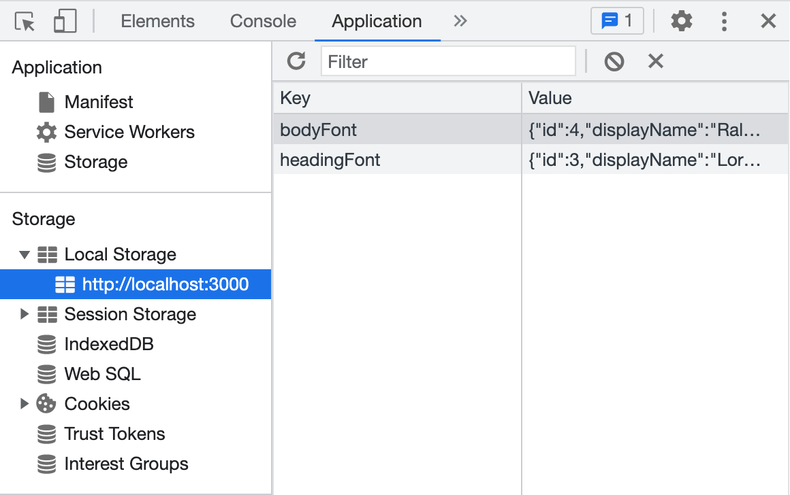

# Custom Hooks Challenge

In Visual Studio code, press `command+shift+v` (Mac) or `ctrl+shift+v` (Windows) to open a Markdown preview.

## Reasons for the Challenge

This exercise will teach you how to clean up your code by building your own hooks. With custom hooks, you can reduce the code repeated multiple components. Your codebase will be easier to maintain and refactor because with a custom hook, you will only have to change your code in one place.

## Examples

See https://usehooks.com/ for examples of custom hooks.

See [MDN's documentation on localStorage](https://developer.mozilla.org/en-US/docs/Web/API/Window/localStorage).

## Getting Started

You will need to have two terminal windows open and running at once. If you are using Visual Studio Code, you can click on the split-screen or plus icon in your terminal panel:


In one terminal window, you will need to run the API server. Please follow the _Getting Started_ steps [in this README.md](../../authorization-server/README.md) on how to install and start the server.

In the other terminal window, you will need to navigate to the this folder, install all dependencies, and start this exercise.

```bash
cd exercises/19-custom-hooks/
code . # if you would like to open this in a separate VSCode window
npm install
npm start
```

At any point, if you need to stop the server, press `ctrl+c` .

## User Stories

As a user, I would like to select a Google font for the my website.

As a user, I would like to select a Google font for the headings in my website.

As a user, I would like to preview my body and heading fonts.

As a user, I expect that when I refresh the page, my font selections are still remembered.



## Acceptance Criteria

- You must continue to store the body and heading font inside of `localStorage` so that when the user refreshes, their font selection is not lost.
- You must put all logic that gets and stores fonts in `localStorage` within a custom hook.
- You must use the `useAsync` hook for all AJAX requests.
- Your application should not have any infinite loops with AJAX calls. Make sure that any "fetcher" functions are placed outside of React components.

## Instructions

This assignment is already functional. You will be refactoring the code to use custom hooks.

Create a file called _src/hooks/useFont.jsx_. It should have a custom hook called _useFont_. This should be where your code writes and reads from `localStorage`. Refactor _src/components/FontSelector/FontSelector.jsx_ and _src/components/Preview/Preview.jsx_ so that they work with your new _useFont_ hook.

Note that if you need to, you can use the browser's Developer Tools to edit `localStorage`.



The _useAsync_ hook has been created for you. Update _src/components/FontSelector/FontSelector.jsx_ so that it makes an AJAX call with this hook. Be sure to check the "Network" tab inside of your browser's Developer Tools to make sure that the AJAX request is not being spammed.
